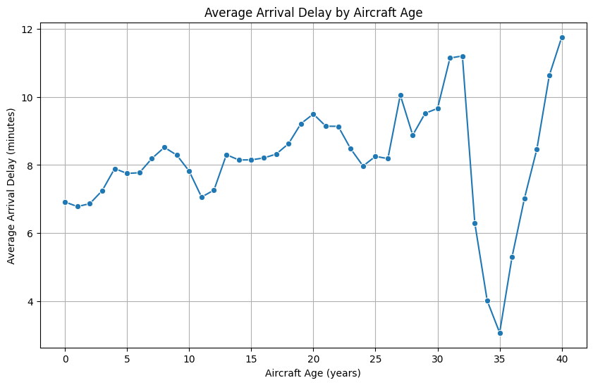
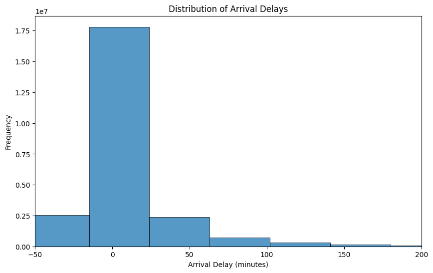
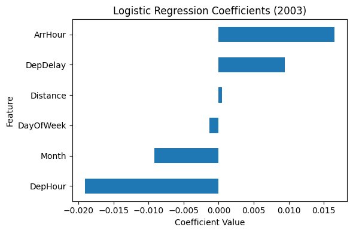
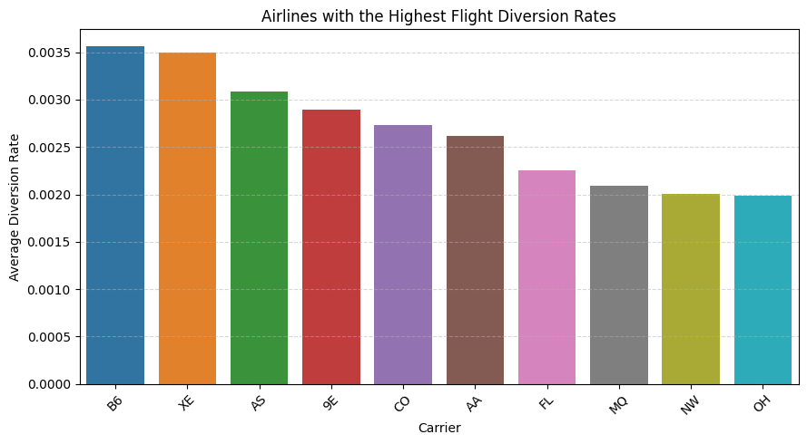

# Flight Delay & Diversion Analysis

This project investigates the key drivers of flight delays and diversions using large-scale aviation data.

The objective is to identify operational factors affecting airline performance and understand how delays propagate through the system.

---

## Key Questions

- Does aircraft age impact flight delays?  
- What explains the distribution of delays?  
- What factors increase the likelihood of flight diversion?  

---

## Key Insights

- Aircraft age has a **weak relationship** with delays  
- Delay distributions are **highly skewed**, with extreme events driving averages  
- Departure delays significantly **increase the probability of diversion**  
- Operational factors appear more influential than aircraft characteristics  

---

## Approach

The analysis follows a structured data science workflow:

- Data cleaning and preprocessing  
- Feature engineering (e.g. aircraft age)  
- Exploratory data analysis  
- Logistic regression modeling  

---

## Visual Insights

### Aircraft Age vs Delay  
Aircraft age shows a weak relationship with arrival delays.

---

### Delay Distribution  
Delays are highly skewed, with extreme values driving overall averages.

---

### Logistic Regression Model  
Departure delays significantly increase the probability of flight diversion.

---

### Carrier Diversion Rates  
Variation exists across carriers, but differences remain relatively small.

---

##  Notes on Data

The dataset covers flights from **2003–2007**.

The purpose of this project is to identify **structural patterns** in delays and diversions rather than reflect current industry conditions.

---

##  Tools & Technologies

- Python (Pandas, NumPy, Seaborn, Matplotlib)  
- Statistical modeling (Logistic Regression)  

---

## Repository Structure

flight-delay-analysis/
│
├── README.md
├── report.pdf
│
├── notebooks/
│ └── analysis.ipynb
│
└── visuals/
├── aircraft_age_vs_delay.png
├── delay_distribution.png
├── diversion_model.png
└── carrier_diversion_rates.png

---

## Conclusion

Flight delays and diversions are primarily driven by **operational factors**, particularly departure delays, rather than aircraft characteristics.

Improving early-stage operational efficiency could significantly reduce disruption risk.